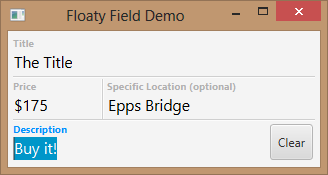

# Floaty Field

Floaty Field is a JavaFX port of the [JVFloatLabeledTextField](https://github.com/jverdi/JVFloatLabeledTextField) project.



Credits for the concept to Matt D. Smith, and his [original design](http://dribbble.com/shots/1254439--GIF-Mobile-Form-Interaction?list=users):


Say Hi [@erlyberlytips](https://twitter.com/erlyberlytips) or check it out on [youtube](http://www.youtube.com/watch?v=R432dKBK2aU&feature=youtu.be)

### Compiling

To add floaty-field as a Maven dependency, add the jitpack repository to your project's `pom.xml`.

```xml
<repositories>
  <repository>
    <id>jitpack.io</id>
    <url>https://jitpack.io</url>
  </repository>
</repositories>
```

Now you can add floaty-field to your pom.xml dependencies:

    <dependency>
      <groupId>andytill</groupId>
      <artifactId>floaty-field</artifactId>
      <version>1.1.0</version>
    </dependency>

### Usage

Firstly, make sure that the floaty field css is added to the scene that the control will be used in.

```java
scene.getStylesheets().add(getClass().getResource("/floatyfield/floaty-field.css").toExternalForm());
```

Without this, the style and layout will look very bad! To instantiate a `FloatyFieldControl` call the
constructor.

```java
FloatyFieldControl myControl = new FloatyFieldControl();
```

The prompt text is shown in large when there is no text, when the text is not empty the prompt text is shown in small above.

```java
myControl.getModel().promptTextProperty().set("Node Name");
myControl.getModel().textProperty().set("Some Input");
```
